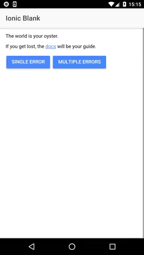

## Related post: [HTTP error handling; informing the user in an Ionic 2+ App](https://www.ionicrun.com/http-error-handling-informing-the-user-in-an-ionic-2-app/)

<p align="center">
  
</p>

## Install & Run

```bash
# download or clone
$ git clone https://github.com/ionicrun/http-errors-using-events-ionic-2.git
$ cd http-errors-using-events-ionic-2

# install the packages
$ npm i

# serve or run
$ ionic cordova run ios
# or
$ ionic cordova run android

```